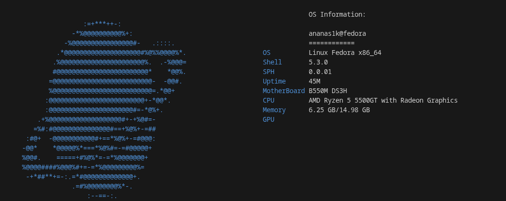

# Sphere

# Sph

`Sph` is your ultimate Linux companion, combining speed, flexibility, and precision. Built with Rust and Python, it empowers you to manage your system like a pro, effortlessly.  

With `Sph`, you can:  
- **Update and manage packages** across multiple package managers (apt, dnf, pacman, zypper) with just a few commands.  
- **Check for updates** without making changes, keeping your system safe and up-to-date.  
- **Monitor hardware instantly** — get detailed info on CPU, RAM, GPU, disk, and network.  
- **Visualize your system** with logos, user info, and quick system summaries.  
- **Automate and optimize** your workflow with minimal output or fully interactive modes.  

`Sph` combines the raw performance of Rust with the versatility of Python, giving Linux enthusiasts and system administrators a powerful, reliable, and easy-to-use toolkit — all from the terminal.  

Whether you're a power user, a sysadmin, or just curious about your system, `Sph` makes Linux management fast, clear, and fun.

---

## 🔹 Features

- Optimize Linux systems and manage resources.  
- Display detailed system information: RAM, CPU, network.  
- Download and install third-party packages.  
- Display logos and custom ASCII graphics.  

---

## 🔹 Available Commands

| Command        | Description                                                                                     |
|----------------|-------------------------------------------------------------------------------------------------|
| `install`      | Install packages                                                                                |
| `update`       | Update system packages. Supports flags:\n  - `-y` auto-confirm all prompts\n  - `-q` quiet mode |
| `check-update` | Check for available system package updates across multiple package managers (dnf, apt, pacman, zypper). Displays packages that can be updated without performing the update |
| `ram -f/-m`    | Show RAM information (-f full, -m minimal)                                                     |
| `cpu -f/-m`    | Show CPU information (-f full, -m minimal)                                                     |
| `net -f/-m`    | Show network interface info (-f full, -m minimal)                                              |
| `logo`         | Display a logo or ASCII graphic                                                                |
| `users`        | Show all users                                                                                 |
| `sphfetch`     | Display system info and logo                                                                   |
| `v`            | Show the version of the utility                                                               |
| `--help`       | Show help and available commands                                                               |

## 🔹 Supported Linux Distributions

| Distribution / Family      | Package Manager | Supported | Notes |
|----------------------------|----------------|-----------|-------|
| Ubuntu                     | apt            | ✅        | Full support for update & check-update |
| Debian                     | apt            | ✅        | Full support for update & check-update |
| Linux Mint                 | apt            | ✅        | Uses apt like Ubuntu |
| Fedora                     | dnf            | ✅        | Full support for update & check-update |
| CentOS Stream              | dnf            | ✅        | Requires dnf ≥ 4 |
| RHEL ≥8                    | dnf            | ✅        | Full support |
| Arch Linux                 | pacman         | ✅        | Supports `-Syu` and `-Qu` |
| Manjaro                    | pacman         | ✅        | Pacman-based, same commands |
| openSUSE Leap              | zypper         | ✅        | Supports `update` and `list-updates` |
| openSUSE Tumbleweed        | zypper         | ✅        | Rolling release support |
| Other Debian-based         | apt            | ⚠️        | Partial support, may vary |
| Other RedHat-based         | dnf            | ⚠️        | Partial support, may vary |
| Other Arch-based           | pacman         | ⚠️        | Partial support, may vary |
| Other SUSE-based           | zypper         | ⚠️        | Partial support, may vary |

## example

